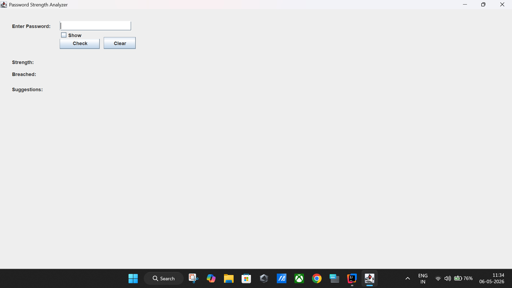
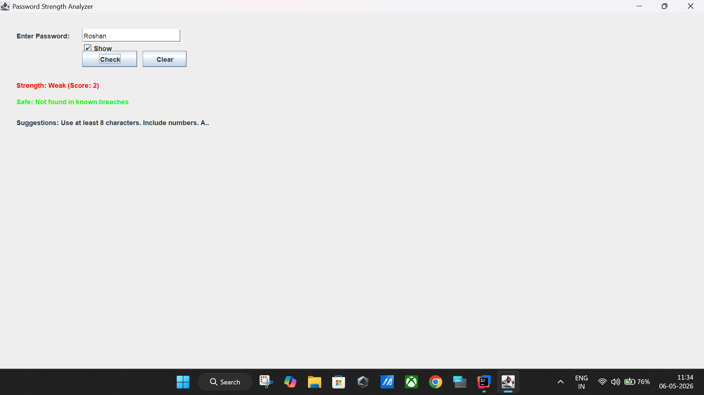
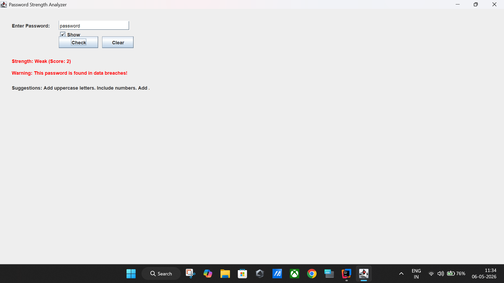
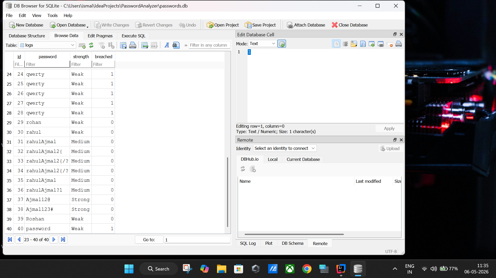
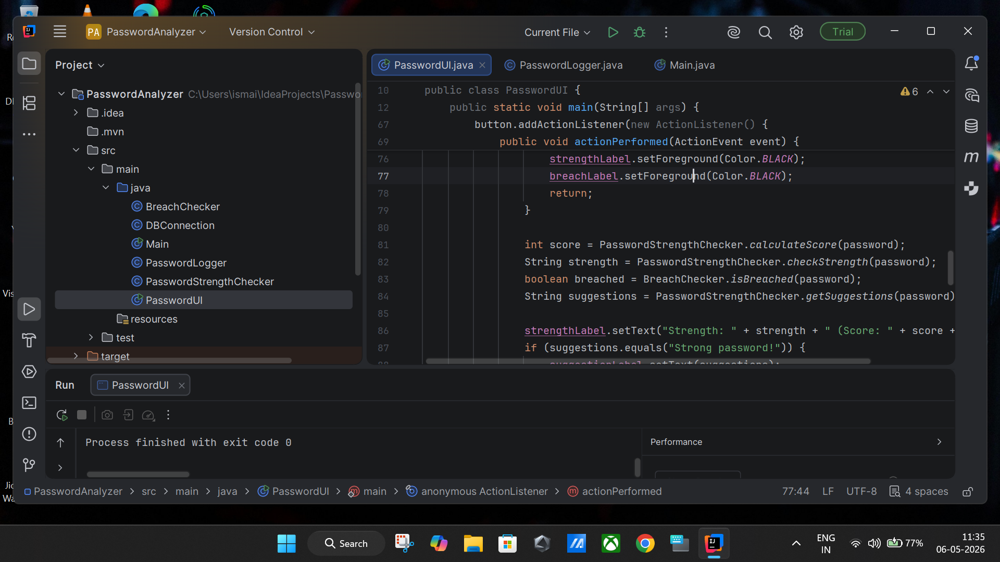

# Password Strength Analyzer and Breach Checker

## Overview

Password Strength Analyzer and Breach Checker is a cybersecurity-focused Java application designed to evaluate password security and identify passwords that appear in a breached password dataset.

The project demonstrates practical cybersecurity concepts including password security assessment, breach detection, secure database interaction, and user awareness mechanisms.

---

## Key Cybersecurity Concepts Demonstrated

- Password Security Analysis
- Breached Password Detection
- Secure Database Queries using Prepared Statements
- Basic Security Risk Assessment
- Authentication Security Awareness
- Input Validation
- SQLite Database Security Integration

---

## Features

### Password Strength Analysis
Evaluates password complexity based on:

- Password Length
- Uppercase Characters
- Lowercase Characters
- Numeric Characters
- Special Characters

### Breach Detection
Checks whether a password exists within a database of commonly breached passwords.

### Security Recommendations
Provides suggestions to improve weak passwords and enhance account security.

### Logging System
Stores analysis results including:

- Password Strength
- Breach Status
- Analysis Records

### User Interface
Built using Java Swing with:

- Show/Hide Password Option
- Visual Strength Indicators
- Real-Time Feedback

---

## Technology Stack

| Component | Technology |
|------------|-------------|
| Programming Language | Java |
| User Interface | Java Swing |
| Database | SQLite |
| Database Connectivity | JDBC |
| Development Environment | IntelliJ IDEA |

---

## Project Architecture

```text
User Input
     │
     ▼
Password Strength Analyzer
     │
     ▼
Breach Checker
     │
     ▼
Suggestions Engine
     │
     ▼
Database Logger
     │
     ▼
Result Display
```

---

## Project Structure

```text
src/main/java
│
├── Main.java
├── PasswordUI.java
├── PasswordStrengthChecker.java
├── BreachChecker.java
├── PasswordLogger.java
└── DBConnection.java
```

---

## Security Implementation

### Password Strength Scoring

The application evaluates passwords using a rule-based scoring model that considers:

- Length Requirements
- Character Diversity
- Complexity Metrics

### Breach Verification

Passwords are compared against a breached-password dataset stored in SQLite.

### Secure Database Access

Prepared Statements are used for database queries to reduce SQL Injection risks.

Example:

```java
PreparedStatement pstmt =
    conn.prepareStatement(query);
```

---

## Sample Test Cases

| Password | Strength | Breached |
|-----------|-----------|-----------|
| 123 | Weak | No |
| password | Weak | Yes |
| Admin123 | Medium | No |
| Admin@123 | Strong | No |
| 123456 | Weak | Yes |

---

## Future Enhancements

- SHA-256 Password Hashing
- Password Entropy Calculation
- Integration with Have I Been Pwned API
- Real-Time Breach Intelligence
- Advanced Password Policy Engine
- Security Analytics Dashboard

---

## Learning Outcomes

This project helped strengthen practical knowledge in:

- Secure Java Development
- JDBC and Database Integration
- Password Security Concepts
- Cybersecurity Fundamentals
- GUI Development
- Application Design

---
## Project Screenshots

### User Interface



---

### Password Analysis Result



---

### Breach Detection



---

### Database Logs



---

### Source Code Structure



## How to Run

### Prerequisites

- Java 17 or higher
- Maven
- SQLite
- IntelliJ IDEA (recommended)

### Installation

1. Clone the repository

```bash
git clone https://github.com/sheikismailajmal/PasswordAnalyzer.git
```

2. Open the project in IntelliJ IDEA

3. Wait for Maven dependencies to download

4. Ensure the SQLite database file (`passwords.db`) is present in the project directory

### Running the Application

1. Navigate to:

```text
src/main/java
```

2. Run:

```java
PasswordUI.java
```

3. Enter a password in the application

4. View:
   - Password Strength Analysis
   - Breach Detection Status
   - Security Recommendations

### Example

Password:

```text
123456
```

Result:

```text
Strength: Weak
Breached: Yes
```

Password:

```text
Admin@123
```

Result:

```text
Strength: Strong
Breached: No
```

## Author

**Sheik Ismail Ajmal**  
MCA Cybersecurity  
Jain University

GitHub: github.com/sheikismailajmal

---

## Disclaimer

This project is intended for educational and cybersecurity awareness purposes. It simulates breach detection using a local dataset and should not be considered a replacement for enterprise-grade password security solutions.
